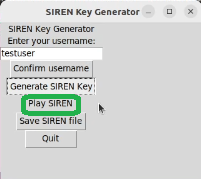

<h1 align="center">SIREN 🚨</h1> <br />

SIREN is an implementation of an audio-based recovery key aim to impede digital forensic investigator from gaining access to a system easily. <br />
This is a project for ICT2202 Digital Forensics that sets out to explore a technical solution that can be used for engaging in anti-forensics. <br />

## 📖 Background
The use of knowledge-based authentication such as a text-based password or recovery key is the most widely adopted method for verifying a user’s identity or gaining access to a computer system. This method of recovery can be cracked through brute forcing the combinations or examining the location of where the recovery key resides in the system. Since most personal digital devices are built with microphones and the audio recognition authentication method is not widely practised as a recovery method, the audio-based recovery process proposed would demonstrate the difficulties for digital investigators attempting to gain access or recover a locked system.
<br />
As a proof of concept, the process of audio recovery key will be demonstrated in a simulated environment running on a Python program.

## ✔️ Prerequisites
* Linux Environment (this project is tested on a Linux environment)
* Python3
* Laptop with built-in or external microphone

## 🛠️ Setup
This section explains the process of setting up SIREN 

### Install dependencies for Music Generator, Audio Fingerprinting and Simulated environment for recovery process

* [`simpleaudio`](https://pypi.org/project/simpleaudio/), for audio playback capability
* [`tones`](https://pypi.org/project/tones/), for generating tones and audio samples
* [`pyaudio`](https://pypi.org/project/PyAudio/), for grabbing audio from microphone
* [`ffmpeg`](https://github.com/FFmpeg/FFmpeg), for audio file format conversion
* [`pydub`](http://pydub.com/), a Python ffmpeg wrapper
* [`random`](), for generating randomized tones
* [`numpy`](http://www.numpy.org/), for taking the FFT of audio signals
* [`scipy`](http://www.scipy.org/), used in peak finding algorithms
* [`matplotlib`](http://matplotlib.org/), used for spectrograms and plotting
* [`mysql-connector-python`](https://pypi.org/project/mysql-connector-python/), for interfacing with MySQL databases
* [`psycopg2-binary`](https://pypi.org/project/psycopg2-binary/), for implementation of database adapter
* [`PyDejavu`](), for audio fingerprinting

1. Install the dependencies using the command below <br />
 `pip3 install -r requirements.txt`

2. To simulate a login and recovery environment in Linux, install [`tkinker`]() <br />
`sudo apt install python3-tk`

3. Install ffmpeg binary for audio file format conversion <br />
`sudo apt install ffmpeg`

### Install MySQL database for storing audio fingerprint
4. Install MySQL <br />
`sudo apt install mysql-server`

5. Configure MySQL secure installation <br />
`sudo mysql` <br />
`ALTER USER 'root'@'localhost' IDENTIFIED WITH mysql_native_password by 'password';` <br />
`mysql_secure_installation` <br />

6. Create a database to store audio fingerprints <br />
`mysql -u root -p` <br />
`CREATE DATABASE IF NOT EXISTS audiobank;` <br />

7. Edit [database configuration]() according to the database credentials set up in Step 5.
```
{
    "database": {
        "host": "127.0.0.1",
        "user": "root",
        "password": "password",
        "database": "audiobank"
    },
    "database_type": "mysql"
}
```

### Troubleshoot issues
If `pyaudio` failed to install on Ubuntu machines, install portaudio modules using the steps below  <br />
```
sudo apt-get install libasound-dev
wget http://files.portaudio.com/archives/pa_stable_v190700_20210406.tgz
tar -xzvf pa_stable_v190700_20210406.tgz
cd portaudio/
./configure && make
sudo make install
sudo pip install pyaudio
```

## 👨‍💻 Running the program

### Run the music generator program start generating a key for a specific user
`python3 music_generator.py`


### Enter username (used for logging in to the system) and generate the audio key 


### Playback the audio key or re-generate the audio to your liking. 



### Saves the audio key file
In an actual scenario, this audio file can be saved on a separate system such as a mobile device with audio play back capability after fingerprinting. However for demonstration, the generated audio file which serves as the recovery key will resides on the same system under [music_generator]() folder.


### Start fingerprinting the generated audio key
`python3 savePassAudio.py`


### Launch the simulated login environment
`python3 login.py`


### Upon 3 fail attempts, the system will be locked. This is to illustrate a locked system or an encrypted drive that requires a recovery key


### To recover the account, click on the audio key button and play the corresponding audio key for the user


### When the audio played matches the audio fingerprint hashes for the user, access to the system is recovered


## 🙏 Credits


